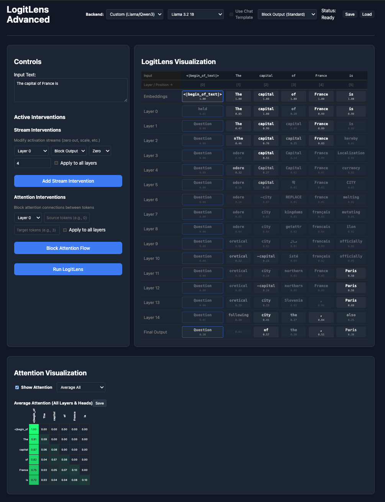
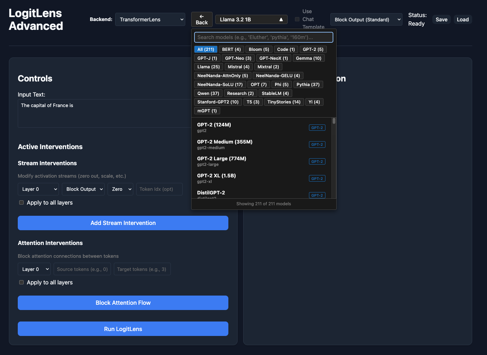

# Logit Lens Llama Advanced

An interactive tool to analyze and intervene on LLM internal states. Now updated to support TransformerLens backend.

## Example


Now support visualize Attention and TransformerLens Backend

| Attention Visualization | TransformerLens Backend |
|------------------------|----------------|
|  |  |

## Features

- **Interactive Logit Lens**: Visualize the model's prediction at every layer (Embeddings -> Layers -> Output).
    - Option to include or exclude Post Attention LogitLens.
- **Interventions**: Modify internal streams (Residual, Attention, MLP)
    - **Zero**: Zero out specific vector streams.
    - **Scale**: Scale vectors by a factor.
    - **Block Attention**: Prevent information flow between specific tokens on a layer or across layers.
        - FYI: Attention blocking mechanism happens before softmax, sending -inf to attention scores. Attention scores will add up to 1.
- **Session Management**: Save and load your analysis sessions (config + full tensor state).
    - Sessions will be saved to `saved_states/` directory. 
    - Interventions, LogitLens results are saved in the `config.json` file
    - Activations are saved in the `tensors.npz` file. These can be used for further experiments (L2 norm, cosine similarity, etc.)
        - Update on Nov 25, 2025: Now includes attention scores in the `tensors.npz` file.
    - Size of `tensors.npz` file is large. Keep it in mind. (73MB for 3.2 3B 51 tokens)
- **Attention Visualization**: Visualize attention scores. You have option to visualize
    - Average attention scores across all layers and heads
    - Average attention scores across particular layer
    - Attention scores for a particular head
    - Furthermore, you can save the attention visualization as a png file by clicking Save button.
        - Some examples can be found in the `attention_visualizations/` directory.
    

## Installation

1.  **Backend**:
    ```bash
    # Basic installation (custom backend only)
    uv sync

    # With TransformerLens backend support
    uv sync --extra transformerlens
    ```

2.  **Frontend**:
    ```bash
    cd frontend
    npm install
    ```

In order to access Llama models from meta-llama you would need to set up a [huggingface token](https://huggingface.co/docs/hub/en/security-tokens).

## Backend Options

The tool now supports two backend implementations:

- **Custom Backend**: Original implementation control over **Llama** and **Qwen3** architectures
- **TransformerLens Backend**: Uses the [TransformerLens](https://github.com/neelnanda-io/TransformerLens) library for broader model support (200+ models including GPT-2, Mistral, Phi, Gemma, Qwen1/1.5/2/2.5, and more)

You can switch between backends in the frontend UI. The UI provides:
- Predefined model dropdown with popular models
- **Searchable model browser**: When using TransformerLens backend, select "Browse All TransformerLens Models (211)..." to access a searchable dropdown with 211 officially supported models. Search by model name, family (e.g., "Pythia", "Gemma"), or size (e.g., "160m") 

## Usage

1.  **Start the Backend**:
    ```bash
    uv run uvicorn server_v2:app --reload --port 8000
    ```

2.  **Start the Frontend**:
    ```bash
    cd frontend
    npm run dev
    ```

3.  Open `http://localhost:5173` in your browser.

## Minor Quirks
If you don't have models in your cache, the program will attempt to download them from HuggingFace. Current UI doesn't give indication of this, and appear to be frozen. Check the terminal for progress.

Stream intervention's Attention Output modification modifies the attention output right before adding to the residual stream. Thus, **this intervention wouldn't be seen in visualize attention.**

## Testing

To verify both backends work correctly, run:

```bash
# Compare Custom vs TransformerLens output (comprehensive test)
uv run python tests_backend/test_backend_parity.py

# Detailed normalization and probability comparison
uv run python tests_backend/test_norm_debug.py

# Test attention blocking
uv run python tests_backend/test_attention_blocking.py

# Basic backend functionality test
uv run python tests_backend/test_backends.py
```

**Expected Results:**
- ✅ Top-1 predictions match 100%
- ✅ Top-5 overlap 90%+
- ✅ Probability differences <1%


## Recent Updates

- **2026-01-13**: Fixed a bug where the final output was being normalized twice.
- **2026-01-12**: Implemented support for TransformerLens backend.
- **2025-11**: Added Qwen3 model support

## TODO

- [X] Add support for Qwen models
- [X] Add TransformerLens backend support
- [X] Fix backend parity issues
- [ ] Create updated demo
- [ ] Create better UI indications
- [ ] Create a diff screen
    - [ ] Diff based on interventions
    - [ ] Diff based on model checkpoints
- [ ] Activation Analysis Tools


## License

MIT
