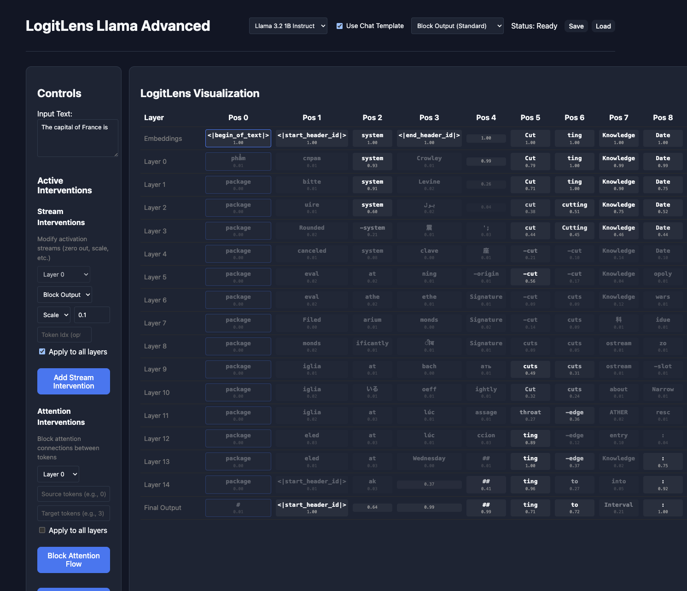

# Logit Lens Llama Advanced

An interactive tool to analyze and intervene on Llama model internal states. Now updated to support Instruct Llama models, and visualize Attention!

## Demo


Now supports Instruct models, and visualize Attention!

| Attention Visualization | Instruct Model |
|------------------------|----------------|
|  |  |
## Features

- **Interactive Logit Lens**: Visualize the model's prediction at every layer (Embeddings -> Layers -> Output).
    - Option to include or exclude Post Attention LogitLens.
- **Interventions**: Modify internal streams (Residual, Attention, MLP)
    - **Zero**: Zero out specific vector streams.
    - **Scale**: Scale vectors by a factor.
    - **Block Attention**: Prevent information flow between specific tokens on a layer or across layers.
        - FYI: Attention blocking mechanism happens before softmax, sending -inf to attention scores. Attention scores will add up to 1.
- **Session Management**: Save and load your analysis sessions (config + full tensor state).
    - Sessions will be saved to `saved_states/` directory. 
    - Interventions, LogitLens results are saved in the `config.json` file
    - Activations are saved in the `tensors.npz` file. These can be used for futher experiments (L2 norm, cosine similarity, etc.)
        - Update on Nov 25, 2025: Now includes attention scores in the `tensors.npz` file.
    - Size of `tensors.npz` file is large. Keep it in mind. (73MB for 3.2 3B 51 tokens)
- **Attention Visualization**: Visualize attention scores. You have option to visualize
    - Average attention scores across all layers and heads
    - Average attention scores across particular layer
    - Attention scores for a particular head
    - Furthermore, you can save the attention visualization as a png file by clicking Save button.
        - Some examples can be found in the `attention_visualizations/` directory.
    

## Installation

1.  **Backend**:
    ```bash
    uv sync
    ```

2.  **Frontend**:
    ```bash
    cd frontend
    npm install
    ```
In order to access Llama models from meta-llama you would need to set up a [huggingface token](https://huggingface.co/docs/hub/en/security-tokens). 

## Usage

1.  **Start the Backend**:
    ```bash
    uv run uvicorn server:app --reload --port 8000
    ```

2.  **Start the Frontend**:
    ```bash
    cd frontend
    npm run dev
    ```

3.  Open `http://localhost:5173` in your browser.

## License

MIT
